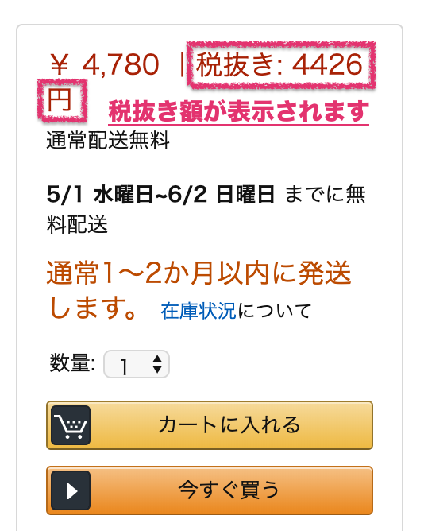

# Amazonで税抜き表示するブックマークレット

----

## これは何

* Amazonで税抜き表示するブックマークレットです。
* [Github Pages](https://equinox79.github.io/amazon-de-zeinuki-bookmarklet/)にて公開

## こんなふうに表示されます

## 注意点

* APIを使っているわけでは無いので商品によっては（ちゃんと表示されない｜正しい金額じゃない）可能性があります。悪しからず。

## 導入方法

下のページを見てセットアップしてください。

[インストール用ページ](misc/install.html)

## 使い方

アマゾンの商品ページで、ブックマークバーに置いた `Amazonで税抜き表示` をクリックしてください。
右側の価格に税抜き価格が併記されます。
